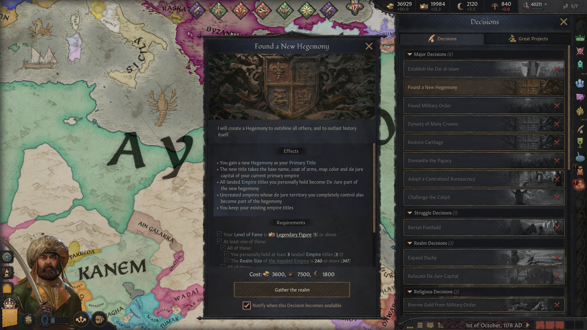
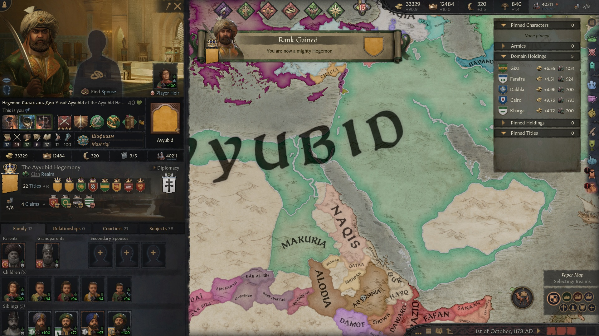
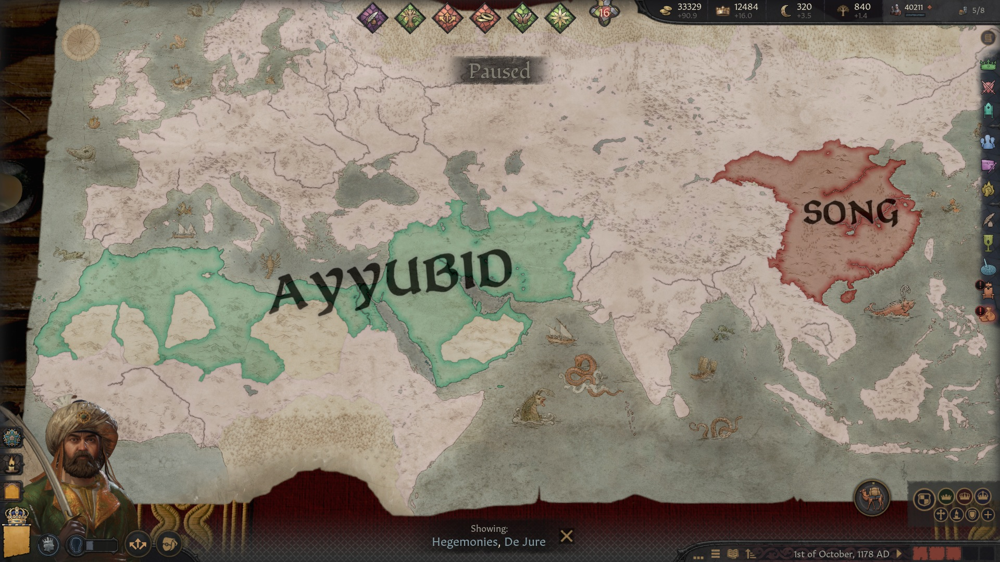

# Your Own Hegemony [1.20]

## At a glance

- 🟢 **Version 0.1.4** · Targets CK3 **1.20.0.4**.
- 🟢 **Standalone:** no other mod required.
- 🟢 **Found a New Hegemony:** unite several imperial crowns under a new primary title above empire rank.
- 🟢 **Languages:** English, French, German, Japanese, Korean, Polish, Russian, Simplified Chinese and Spanish.
- 🔴 **Changes gameplay:** creates a new title and reorganizes eligible empires de jure; AI rulers can use the same decision.
- 🔴 **Total conversions and other hegemony-formation mods are untested.** Removal after founding and multiplayer are unverified.

## An empire is only the beginning

Make late-game rule easier: unite your imperial crowns under a single hegemony, with a new primary title above empire rank.

Build on your realm's own identity. Your new hegemony takes its base name, coat of arms, map color and de jure capital from your former primary empire. You can rename it in the ordinary title window.

## What founding does

- Creates a real dynamic **hegemony** and makes it your primary title.
- Places every landed empire you personally hold beneath it **de jure**.
- Also incorporates empires with no holder whose entire de jure territory you control, following vanilla custom-empire behavior.
- Keeps your existing empire titles, county ownership and vassals.

Incorporation happens at founding; later conquests are not automatically included by this mod. It does not add China's special tributary missions, the dynastic cycle or the unique privileges of historical hegemonies.

## Requirements and price

Meet either realm requirement:

- **3 landed empire titles** personally held and **240 realm counties**; or
- **2 landed empire titles** personally held and **360 realm counties**.

Counties include your vassals' land, not just your personal domain. Baronies and landless imperial offices do not count toward these requirements.

Be an **independent, available adult emperor at peace**, outside a confederation, with a landed empire as your primary title and **fame level 5**. Nomadic rulers also need the highest nomadic authority. Existing hegemons do not receive the decision.

Your realm must have no active ceremonial liege: vanilla dissolves that institution when its top liege becomes a hegemon. The vanilla custom-kingdoms/empires rule must allow creation, and the imperial power projection check must pass.

**Cost: 3,600 gold, 7,500 prestige and 1,800 piety.** Governments with a treasury pay treasury instead of gold. Nomadic rulers are exempt from gold and piety costs, following the vanilla decision pattern; their county requirements stay the same.

AI emperors face the same requirements and check the decision every **60 months**.

## Getting started

1. Enable **Your Own Hegemony [1.20]** in your launcher playset. For a manual download, follow the archive's **INSTALL.txt**.
2. As an eligible emperor, open **Decisions > Found a New Hegemony**.
3. Review both requirement branches, effects and costs, then confirm.
4. Inspect the new primary title and its succession. Use **Hegemonies, De Jure** map mode to see the new de jure realm.

Enable one copy only. When updating from **Custom Hegemony**, the internal installation name and script identifiers are unchanged.

## Compatibility and load order

**Vanilla file replacements: none.** The mod adds its own files and needs no companion mod or special order when used alone. Other mods changing the same mechanics can still need compatibility work; no total-conversion or hegemony-mod compatibility is claimed.

No mandatory DLC has been established. Play without **All Under Heaven** has not been verified.

## Saves and known limits

Back up a save before changing its mod list. **Removal after founding a hegemony is untested.** Special title succession laws are not explicitly copied; inspect the new title's succession before relying on elective or other special arrangements.

The two-empire path, incorporation of unheld empires, governments other than clan, special/elective succession and multiplayer remain unverified in play.

## Feedback and support

For bugs, include the CK3 and mod versions, enabled DLCs, load order, steps, a screenshot and the affected save if possible.

[Report an issue on GitHub](https://github.com/G4VV4KH/-CK3-Your-Own-Hegemony/issues)

Email: g4vv4kh@gmail.com

### [Want to support my work? Donate on Ko-fi 💛](https://ko-fi.com/g4vv4kh)

## Find this mod elsewhere

- [Steam Workshop](https://steamcommunity.com/sharedfiles/filedetails/?id=3811201582)
- [Paradox Mods](https://mods.paradoxplaza.com/mods/161501/Any)
- [Nexus Mods](https://www.nexusmods.com/crusaderkings3/mods/401)
- [GitHub](https://github.com/G4VV4KH/-CK3-Your-Own-Hegemony)

## My other mods

### Standalone mods

- [Parley: The Negotiating Table](https://steamcommunity.com/sharedfiles/filedetails/?id=3811090081) — negotiate diplomatic agreements.
- [Marriage Calculation Assistant](https://steamcommunity.com/sharedfiles/filedetails/?id=3811100163) — compare and sort marriage candidates.
- [Vassalization Extended](https://steamcommunity.com/sharedfiles/filedetails/?id=3813943691) — choose Forced Vassalization terms without a county limit.
- [Court Automation](https://steamcommunity.com/sharedfiles/filedetails/?id=3814028714) — automate court positions and recruit courtiers or knights.
- [Nomad Autorefill](https://steamcommunity.com/sharedfiles/filedetails/?id=3814793283) — automatically reinforce nomadic Men-at-Arms using herd or gold.
- [Tax Collection Automation](https://steamcommunity.com/sharedfiles/filedetails/?id=3815381275) — automatically assign tax collectors and optimize tax jurisdictions.
- [Council Assignment Automation](https://steamcommunity.com/sharedfiles/filedetails/?id=3815689627) — automate council appointments and optimize councillor assignments.

### Compatibility patches

- [[compatch] CAA + CA](https://steamcommunity.com/sharedfiles/filedetails/?id=3816373375) — use Council Assignment Automation and Council Autopilot together.

## Credits

Design and playtesting: **G4VV4KH**. Code, translations, cover artwork and publication text were created with generative AI under the author's direction. Localized decision and event prose adapts vanilla CK3 text.

## Screenshots

Found a New Hegemony: review the effects, requirements and resource cost before confirming.

Rank gained: the ruler now holds the Ayyubid Hegemony as the primary title.

Hegemonies, De Jure map mode shows the new Ayyubid hegemony.

## Contributing

See [dev.md](dev.md) for the source layout, checks and contribution workflow.
